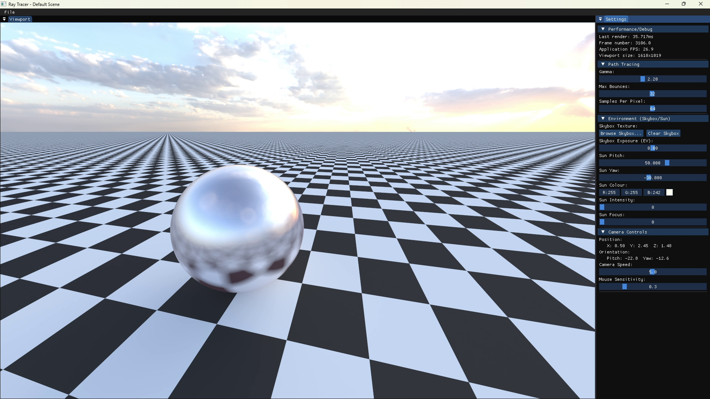
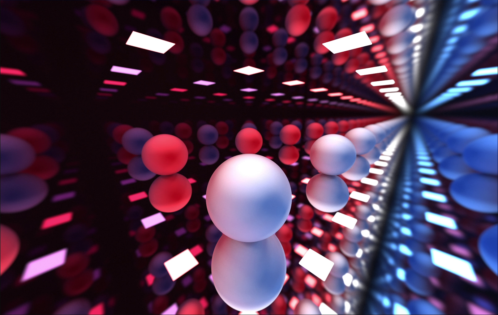
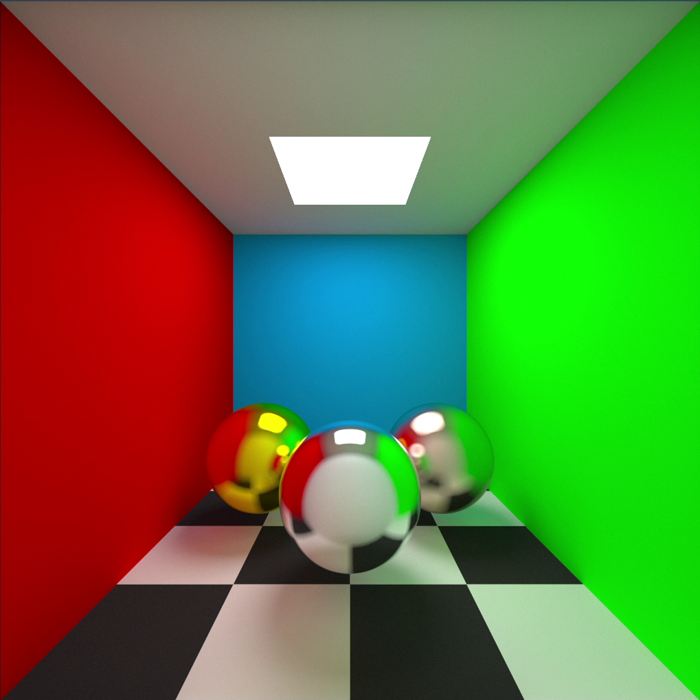
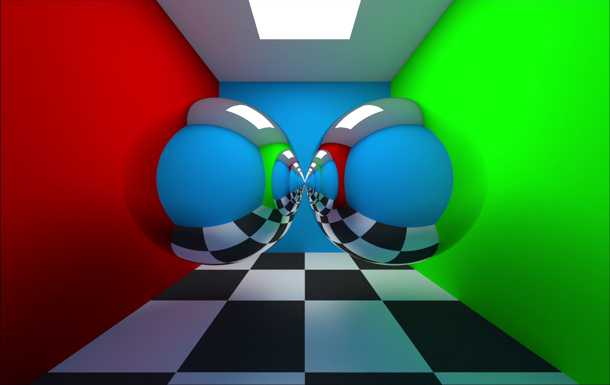
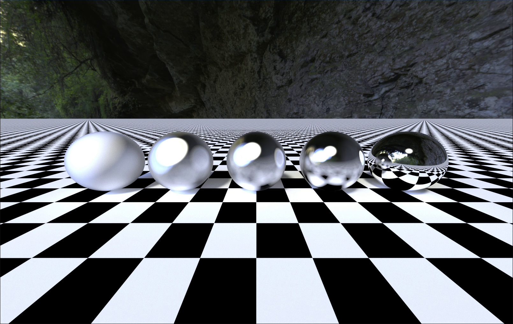
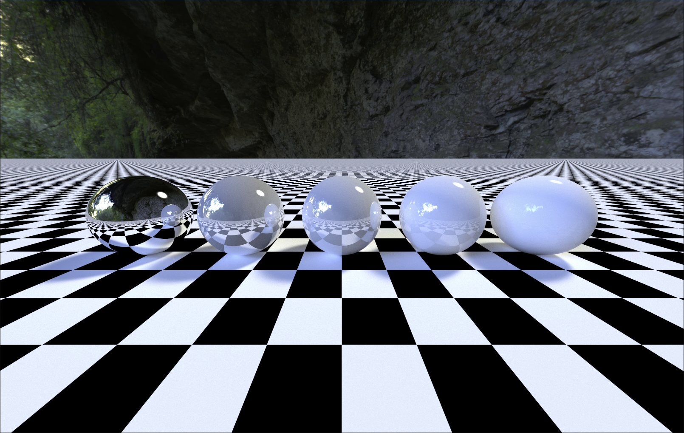

# GPU Path Tracer in C++ and OpenGL


<table>
<tr>
<td style="vertical-align: top; max-width: 550px;">
A GPU-accelerated, physically-based path tracer built with C++ and OpenGL — from scratch.
<br><br>
This was a project I made over two weeks. I've always thought ray tracers look cool and wanted to try creating one from scratch.
</td>
<td>
    <a href="https://shipwrecked.hackclub.com/?t=ghrm" target="_blank">
        
    </a>
</td>
</tr>
</table>



## Features

-   Physically Based Rendering - Realistic lighting and reflections with energy-conserving materials
-   Progressive Rendering - Image quality improves over time with live, frame-by-frame refinement
-   Anti-Aliasing - Smooth edges using subpixel jitter and sample accumulation
-   HDR Environment Maps - Skybox lighting with exposure (EV) control
-   Procedural Sun - Adjustable directional light simulating sunlight
-   Scene Management - Load and edit scenes via JSON files
-   Interactive UI - Responsive ImGui interface with dockable panels and image export

## Technical Features

-   GPU Path Tracing - Using OpenGL and GLSL
-   Material System - Diffuse, specular (glossy/mirror), emissive, smoothness and procedural checker flag
-   Cosine-Weighted Hemisphere Sampling - Physically accurate diffuse light distribution
-   Russian Roulette Termination - Unbiased path termination for efficient global illumination
-   sRGB Gamma Correction - Converts linear output to perceptual colour space
-   Geometry Primitives - Spheres, infinite planes, and quads

## Gallery







## Installation

### Building from Source

To build this project from source, you will need the following prerequisites:

-   C++ 17+ Compiler (e.g., GCC, Clang, MSVC)
-   CMake 3.16+
-   OpenGL 4.4+ drivers and development libraries (usually part of your graphics card driver installation)

#### Dependencies:

-   You do **not** need to install any dependencies in order to build the project :D
-   GLAD and single header files (nlohmann/json, stb) are included in `external/` folder
-   Other dependencies are managed as git submodules:
    -   GLFW
    -   GLM
    -   ImGui
    -   ImGuiFileDialog

### Build Process

Tested on Windows 11 with MSVC. Untested, but should also build on Linux with GCC or Clang.

```bash
git clone https://github.com/Brooklyn-Dev/ray-tracing.git
cd ray-tracing

# Initialise and update all git submodules recursively
git submodule update --init --recursive

# Create build directory and run CMake
mkdir build && cd build
cmake -DCMAKE_BUILD_TYPE=Release ..

# Build the project
cmake --build . --config Release

# Run the executable
cd bin/Release
ray-tracing.exe
```

### Installing Pre-built Releases

1. Download the latest release from the [Releases](https://github.com/Brooklyn-Dev/ray-tracing/releases) page
2. Extract the archive to your desired location
3. Run the executable

## Usage

-   File Menu - Load scenes and export renders
-   Camera
    -   Movement (relative) - Arrow keys
    -   Up/Down - Space / LCtrl
    -   Rotate - LMB + Drag
-   ImGui Windows
    -   Viewport - Displays the render output
    -   Settings - Adjust gamma, bounces, samples, skybox, sun, camera, etc.

## Potential Future Improvements

-   Bounding Volume Hierarchy (BVH)
-   Refraction and transmission materials
-   Real-time scene editor
-   Mesh loading (OBJ, glTF)
-   Image-based textures
-   Depth of field
-   Support for more geometry types (cubes, torus, etc.)
-   Basic video render with animated camera path

## Credits

-   Environment maps by [Poly Haven](https://polyhaven.com/hdris) (CC0)
-   Inspired by Sebastian Lague's [ray tracing devlog](https://www.youtube.com/watch?v=Qz0KTGYJtUk)
-   Inspired by NamePointer's [ray tracing devlog](https://www.youtube.com/watch?v=A61S_2swwAc)
-   [Ray Tracing in One Weekend](https://raytracing.github.io/)
-   The Cherno's [Ray Tracing series](https://www.youtube.com/playlist?list=PLlrATfBNZ98edc5GshdBtREv5asFW3yXl)

## Like this project?

If you find this project interesting or useful, consider giving it a star ⭐️!

## License

This project is licensed under the MIT License. See [LICENSE](LICENSE) for more information.
